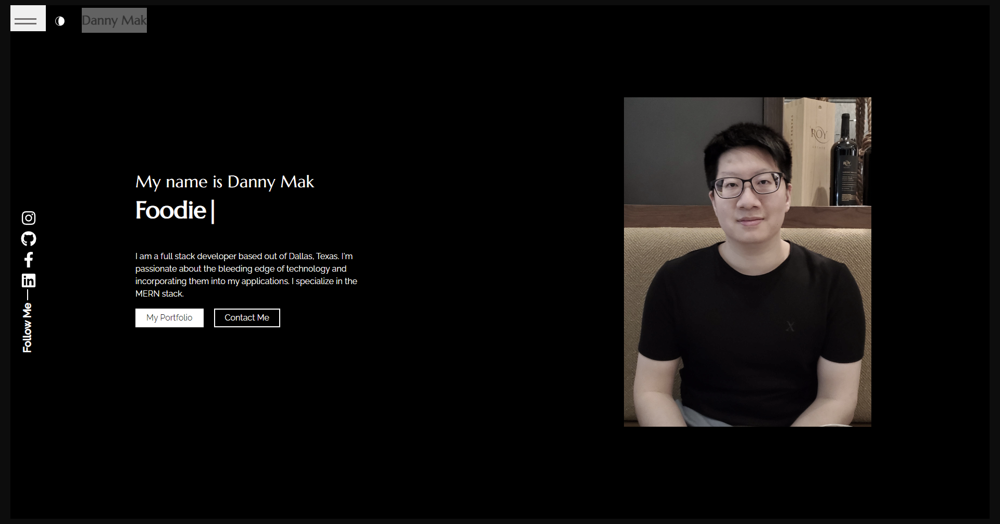
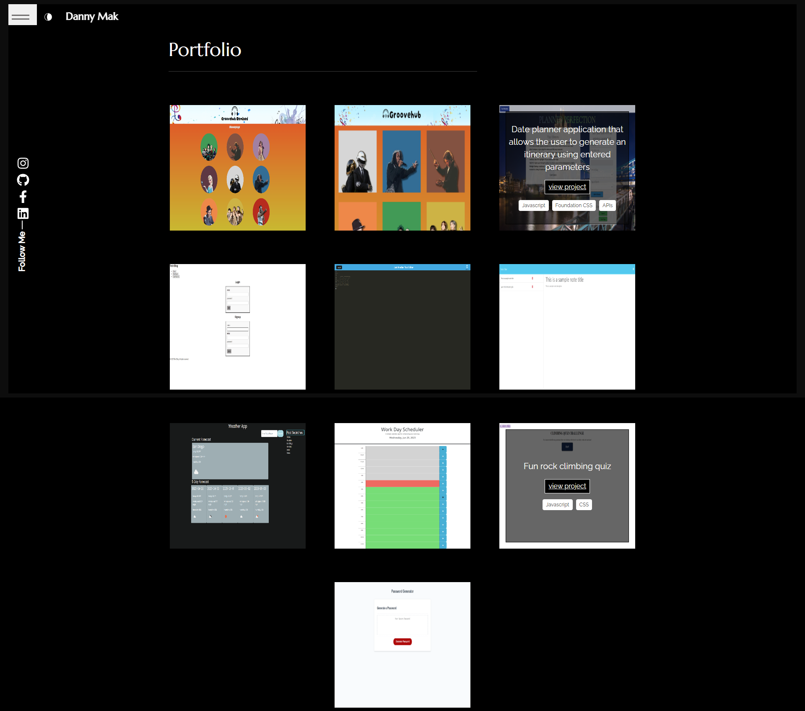

# It-All-Starts-Here

## Description

This is my personal website repository. It is built entirely using React.  

## Table of Contents

- [Installation](#installation)
- [Usage](#usage)
- [Credits](#credits)
- [License](#license)

## Installation

Navigate to the link below to browse my portfolio!

[Live App](https://dannymak.org/)

## Usage

To use this application, begin by navigating to to URL linked in the installation section. You can use the navigation bar in the top left corner or the links on the page to navigate to different pages of the portfolio.  

## Credits

I referenced many classroom activities to familiarize myself with the use of React and browsed many online resources to get the inspiration for this portfolio layout. 

## License

The MIT License (MIT)

Copyright (c) 2015 Chris Kibble

Permission is hereby granted, free of charge, to any person obtaining a copy of this software and associated documentation files (the "Software"), to deal in the Software without restriction, including without limitation the rights to use, copy, modify, merge, publish, distribute, sublicense, and/or sell copies of the Software, and to permit persons to whom the Software is furnished to do so, subject to the following conditions:

The above copyright notice and this permission notice shall be included in all copies or substantial portions of the Software.

THE SOFTWARE IS PROVIDED "AS IS", WITHOUT WARRANTY OF ANY KIND, EXPRESS OR IMPLIED, INCLUDING BUT NOT LIMITED TO THE WARRANTIES OF MERCHANTABILITY, FITNESS FOR A PARTICULAR PURPOSE AND NONINFRINGEMENT. IN NO EVENT SHALL THE AUTHORS OR COPYRIGHT HOLDERS BE LIABLE FOR ANY CLAIM, DAMAGES OR OTHER LIABILITY, WHETHER IN AN ACTION OF CONTRACT, TORT OR OTHERWISE, ARISING FROM, OUT OF OR IN CONNECTION WITH THE SOFTWARE OR THE USE OR OTHER DEALINGS IN THE SOFTWARE.

## Badges

## How to Contribute

If you have any questions or contributions, please don't hesitate to reach out via email at [danny.mak2@gmail.com](mailto:danny.mak2@gmail.com) or through my [GitHub profile](https://github.com/dannymak1993).
